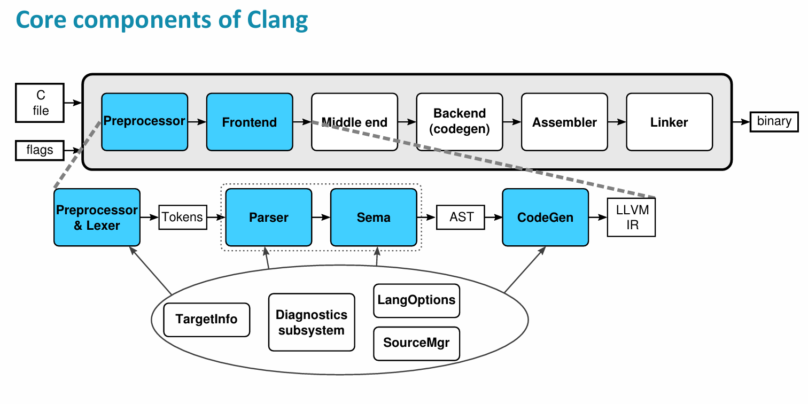

# Clang前端OpenCL编译流程

## Clang编译器概述与编译流程

### 基本架构

Clang是一个编译器驱动程序，其前端编译部分通过驱动cc1完成。作为编译器驱动程序，Clang负责驱动整个编译过程，包括预处理、编译、优化、汇编和链接。

参考llvm社区提供的ppt：


### 编译阶段分析

Clang使用`-ccc-print-phases`选项可以清晰查看每个编译阶段的工作内容、输入和输出：

```bash
./install/bin/clang -ccc-print-phases  -cl-std=CL2.0 -target riscv32 -mcpu=ventus-gpgpu vecadd.cl  ./install/lib/crt0.o -L./install/lib -lworkitem -I./libclc/generic/include -nodefaultlibs ./libclc/riscv32/lib/workitem/get_global_id.cl -O1 -cl-std=CL2.0 -Wl,-T,utils/ldscripts/ventus/elf32lriscv.ld -o vecadd.riscv
```

输出结果展示了完整的编译流程：
```
            +- 0: input, "vecadd.cl", cl
        +- 1: preprocessor, {0}, cpp-output
    +- 2: compiler, {1}, ir
+- 3: backend, {2}, assembler
+- 4: assembler, {3}, object
|- 5: input, "./install/lib/crt0.o", object
|- 6: input, "workitem", object
|           +- 7: input, "./libclc/riscv32/lib/workitem/get_global_id.cl", cl
|        +- 8: preprocessor, {7}, cpp-output
|     +- 9: compiler, {8}, ir
|  +- 10: backend, {9}, assembler
|- 11: assembler, {10}, object
|- 12: input, "-T", object
13: linker, {4, 5, 6, 11, 12}, image
```

### 编译器配置

Clang允许用户为当前构建或安装设置标志，例如包含文件路径、优化级别、宏定义、警告级别等。通过`-###`选项可以查看完整的编译选项：

```bash
./install/bin/clang -###  -S -target riscv32 -mcpu=ventus-gpgpu vecadd.cl -emit-llvm -o vecadd.ll
```

## 编译过程分析

### 预处理阶段

预处理阶段主要处理OpenCL相关的宏定义和扩展支持。可以使用以下命令查看预处理结果：

```bash
./install/bin/clang -E -cl-std=CL2.0 -target riscv32 -mcpu=ventus-gpgpu vecadd.cl
```

#### OpenCL宏定义处理

预处理器会将opencl-c.h添加到源文件中并进行宏展开。其中一个重要的指令是：

```c
#pragma OPENCL EXTENSION all : disable
```

这表示默认禁用所有OpenCL扩展。如需使用特定扩展，需要在cl文件中显式启用。

#### OpenCL扩展支持

承影编译器在`clang/lib/Basic/Targets/RISCV.h`中定义了支持的OpenCL扩展：

```cpp
void setSupportedOpenCLOpts() override {
    auto &Opts = getSupportedOpenCLOpts();
    Opts["cl_clang_storage_class_specifiers"] = true;
    Opts["__cl_clang_variadic_functions"] = true;
    Opts["__opencl_c_images"] = true;
    Opts["__opencl_c_3d_image_writes"] = true;
    Opts["cl_khr_3d_image_writes"] = true;
    Opts["cl_khr_byte_addressable_store"] = true;
    Opts["cl_khr_fp64"] = true;
    Opts["__cl_clang_variadic_functions"] = true;
}
```

### 词法分析阶段

词法分析阶段主要负责将源代码转换为token序列。可以使用以下命令查看lexer解析出的token信息：

```bash
./install/bin/clang -c -Xclang -dump-tokens -cl-std=CL2.0 -target riscv32 -mcpu=ventus-gpgpu vecadd.cl
```

#### OpenCL关键字解析

Clang在`clang/include/clang/Basic/TokenKinds.def`文件中管理和维护OpenCL关键字的相关token：

```cpp
// OpenCL地址空间限定符
KEYWORD(__global                    , KEYOPENCLC | KEYOPENCLCXX)
KEYWORD(__local                     , KEYOPENCLC | KEYOPENCLCXX)
KEYWORD(__constant                  , KEYOPENCLC | KEYOPENCLCXX)
KEYWORD(__private                   , KEYOPENCLC | KEYOPENCLCXX)
KEYWORD(__generic                   , KEYOPENCLC | KEYOPENCLCXX)
```

### 语法分析阶段

语法分析阶段将token序列转换为抽象语法树（AST）。可以使用以下命令查看生成的AST：

```bash
./install/bin/clang -c -Xclang -ast-dump  -cl-std=CL2.0 -target riscv32 -mcpu=ventus-gpgpu vecadd.cl 
```

语义分析器与解析器紧密配合，进行语义诊断，相关的错误信息定义在`clang/include/clang/Basic/DiagnosticSemaKinds.td`文件中。

### IR生成阶段

AST生成后经过CodeGen部分转换为LLVM IR。这个过程涉及几个主要组件：

- AST访问器：遍历和处理抽象语法树
- IRBuilder：构建LLVM IR指令
- TargetInfo：获取目标平台相关信息
- CodeGenModule：处理全局状态（如LLVM类型缓存）和生成全局实体
- CodeGenFunction：维护函数级别状态，将函数体内的语句转换为对应的LLVM IR