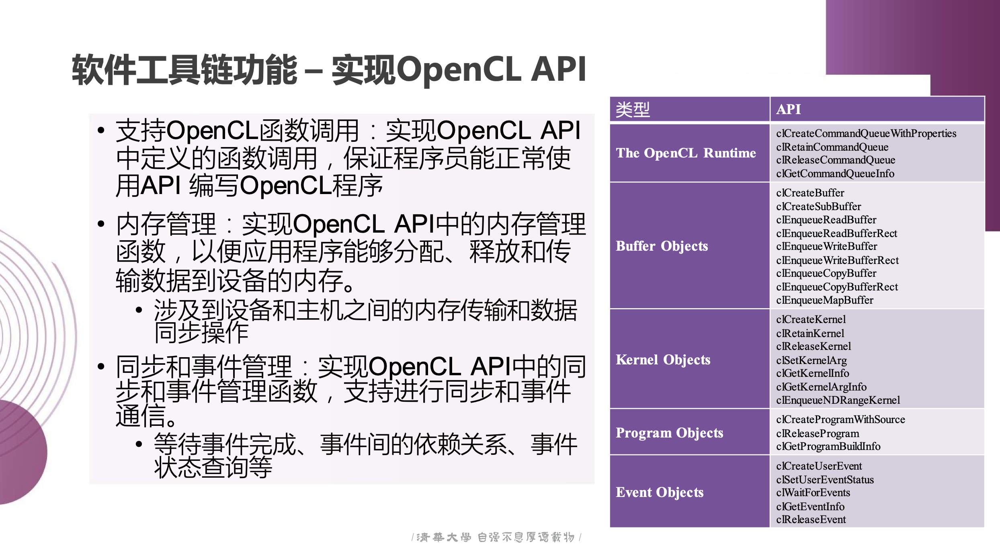

# 乘影编译器概述
## 背景知识
### 乘影GPGPU

乘影 GPGPU （英文名是 Ventus）是基于开源 RISC-V 架构扩展的通用计算 GPU（GPGPU），其设计核心是 RISC-V 向量扩展（RVV）。该架构通过扩展 RISC-V 指令集，实现了 GPU 计算中常见的功能，包括内存访问管理、线程与工作组的分离操作等。

乘影是一种 RISC-V SIMT 拓展架构。在硬件层次上，乘影的计算单元以 SIMD（单指令多数据）的方式执行任务，同时支持 warp 和 thread 的动态分时映射。一个 warp 相当于一个 RVV 程序，通过硬件动态分配到 RVV 处理器的计算通道（lane）上进行执行，而向量元素长度（vlen）通常对应 num_thread（线程数）；在软件层次上，乘影采用了 Vector-Thread 的行为建模方式：使用向量指令（v指令）描述线程的行为，而将工作组统一执行的操作（如地址计算、跳转）作为标量指令。这种设计简化了工作组内线程间的协作，并提升了编译器的优化能力。由于 RVV 指令集支持可变长度操作，其变长特性体现在硬件层面的向量长度（vlen）、元素宽度（SEW）以及分组数量（LMUL）。然而，这些参数在乘影架构中均在编译期固定，大多数情况下，元素数目也被设定为 num_thread，确保高效执行。

乘影的寄存器和指令集架构描述可参考 [乘影架构文档手册：指令集架构及软硬件接口v202.pdf](https://opengpgpu.org.cn/upload/1/editor/1706683586837.pdf "乘影架构文档手册：指令集架构及软硬件接口v202.pdf")。

### 异构编程模型和OpenCL

异构编程模型为 CPU 和 GPU 协同工作的场景提供了标准化的开发框架。其核心在于主机（host）与设备（device）之间的任务分配与执行管理。在此框架下，应用程序分为两部分：运行于主机上的主程序和运行于设备上的核函数（kernel）。主程序负责通过动态库接口（如 OpenCL 提供的 API）调用核函数，并通过 runtime 或 driver 实现硬件资源的调度和内存管理。

OpenCL 是一种并行编程规范，提供了异构编程模型相关的接口。这些接口包括以下关键功能：
1.	设备查询与初始化：主程序通过接口查询 GPU 的能力，如硬件配置、支持的内存类型等。
2.	核函数与主程序编译：通过工具链将核函数代码转化为与设备兼容的可执行文件。
3.	内存管理：分配和管理 GPU 的缓冲区，确保核函数的数据依赖关系得到正确处理。
4.	任务调度与执行：通过命令队列管理核函数的执行顺序，并分配适当的硬件资源。
5.	主机与设备通信：在 CPU 与 GPU 之间传递数据与控制信息，协调任务的执行。

乘影架构在设计上与 OpenCL 的执行模型高度兼容，为开发者提供了方便的编程接口。OpenCL 的运行时系统需要支持任务分配、设备内存管理和命令队列管理等功能，这些正是乘影架构在硬件层面对应的核心设计点。例如，乘影的 warp 和工作组可以直接映射到 OpenCL 的线程和线程块（work-item 和 work-group）模型上，从而简化了程序的开发与优化。在软件层面，乘影还提供了一系列适配 OpenCL 的运行时实现，以便支持核函数的调度、内存资源的管理和命令队列的操作。这些运行时功能确保了乘影能够作为 OpenCL 框架中的设备，参与异构计算任务的执行。乘影支持的 OpenCL 函数接口如下图所示（图片出处：[乘影软件介绍.pdf](https://opengpgpu.org.cn/upload/1/editor/1706684824403.pdf "乘影软件介绍.pdf")）：


## 乘影软件工具链

乘影 GPGPU 的软件工具链基于开放标准，如 OpenCL，核心依赖 LLVM 和 pocl（Portable Computing Language）两大组件，提供设备端核函数编译、任务调度和执行等完整功能。该工具链支持在仿真器上运行 OpenCL 程序，具备良好的开发和测试环境。工具链通过统一的接口将主机程序（host）和设备端内核程序（kernel）串联起来，使两者的编译与运行流程能够高效协同。

设备端的内核程序由 LLVM 编译器生成并链接到静态库中，与乘影 GPU 的 RVV 指令集兼容。这些内核在硬件上以 SIMT 方式运行，工作项划分和资源调度由运行时系统动态管理。运行时（runtime）依托 pocl 通过 OpenCL API 实现对内核程序的编译、运行，以及设备资源的统一控制，形成了一个端到端的异构计算平台。软件工具链执行程序的步骤如下：
1. 资源初始化：使用 spike 初始化资源，包括局部内存（local memory）和程序计数器（PC memory）。运行时通过 pocl 进行全局控制。
2. 编译与任务调度：
   - 指定编译参数，如硬件平台（Ventus）、地址空间（32 位）等。
   - 编译器在内核编译时通过 pocl 将工作维度（work dimension）分割为工作组（work group），完成任务调度。
3. 内存与资源管理：pocl调用 driver API 进行内存对齐和分配，统一管理硬件资源，包括寄存器和设备内存。
4. 内核加载与执行：内核通过命令队列加载到设备，由 spike 运行。任务队列管理、设备枚举、设备查询均在此阶段完成。


乘影支持的 OpenCL 函数接口如下图所示（图片出处：[5-乘影开源GPGPU软件工具链介绍.pdf](https://opengpgpu.org.cn/upload/1/editor/1727601904280.pdf "5-乘影开源GPGPU软件工具链介绍.pdf")）：



## 乘影编译器

LLVM 在乘影编译器开发中起核心作用，其职责是将 OpenCL 程序转换为与 Ventus GPGPU 硬件兼容的可执行文件。编译器流程如下：
- 源码阶段（cl -> ll）：通过 Clang 编译器，将 OpenCL 源代码转换为 LLVM IR（中间表示）。
- 中间阶段（ll -> s/o）：LLVM IR 进一步优化并生成与目标架构相关的汇编代码或二进制文件。
- 链接阶段：结合目标硬件（Ventus）的特性，链接标准库（如 libclc）以及硬件仿真支持函数（如 Spike 入口）。

### 重要特性

其中，乘影编译器涉及RISC-V的相关特性有：
- 一个SM是一个RVV处理器，同时处理多个warp
- 一个warp是一个RVV程序，将计算结果写回寄存器
- 根据程序是否走有发散通路，将值存在vGPR（向量通用寄存器）或sGPR（标量通用寄存器）上。
- 由于借用RISC-V的CPU指令，要处理CPU和GPU上寄存器编码位的差异。

涉及RISC-V的相关特性有：
- 访存操作区分global/local/private memory（赋予RVV访存指令在GPU上的新语义）
  - Global memory - shared by all workgroups.
  - Local memory - shared by all workitems in a warp(workgroup)·
  - Private memory - private to a single workitem
- 显性分配内存地址空间，起始地址由CSRs决定（调用约定）
- 实现libclc函数库，为OpenCL设备提供基本C函数支持

编译流程的过程中的其它要点还包括：
- Calling convention，编译器通过abi取内存，跟driver搬运的规范一致。
- 遵守Opencl内存模型，编译器需要知道哪些数据放到哪些内存里，这会对内存带来影响。这涉及到对vlw.v等访问private memory指令的代码生成。
- libclc/riscv32/lib/crt0.S为内核程序提供了初始化环境并启动内核执行。执行流程包括：
  - 设置全局指针和线程栈指针（如CSR_WID，CSR_LDS等）
  - 遵循Kernel函数调用约定加载入口地址，按照顺序加载arg buffer信息等
  - 跳转到内核程序开始执行
  - 结束后与 Spike 通信终止程序
- utils/ldscripts/ventus/elf32lriscv.ld这个链接脚本为 32 位 RISC-V 架构的 ventus 平台指定了程序的内存布局、符号定义和段的排列方式.使用此链接脚本，main.elf 文件会根据脚本中指定的地址和段布局生成。使用自定义linker是因为要适配spike要求的地址空间。
  - 入口点定义：指定程序从哪里开始执行。
  - 内存布局：定义 ROM、RAM 等物理内存的起始地址和大小。
  - 段定义：描述代码、数据段的位置和对齐方式，指定如何将这些段映射到内存。
  - 符号定义：提供对段和地址的标记，通常用于初始化和运行时管理内存。
  - 栈和堆管理：有时会在脚本中定义栈和堆的大小和位置。

### 构建依赖

- Build llvm（基于上游llvm得到ventus-llvm）
- Build ocl-icd
- Build libclc
- Build isa-simulator（仿真器spike）
- Build sumulator-driver
- Build pocl
- Isa simulation test
- GPU-rodinia testsuite（端到端OpenCL benchmark）
- Pocl testing


### ventus-llvm的git信息统计

```bash
// 查看总共修改了哪些文件
git diff --name-status a996cc217cefb9071888de38c6f05e5742d0106f > 32bit-modified-files.txt

// 查看所有的commit和每个commit所修改的文件
git log --name-only --pretty=oneline a996cc217cefb9071888de38c6f05e5742d0106f..HEAD > 32bit-commit-log.txt

// 查看commit的总数量
git rev-list --count a996cc217cefb9071888de38c6f05e5742d0106f..HEAD

// 查看所有已修改的文件信息和修改细节
git diff --patch-with-stat a996cc217cefb9071888de38c6f05e5742d0106f > 32bit.patch

// 查看特定文件的修改历史
git log -- <file_name>

// 查看特定文件的具体修改细节（等同于在patch里搜索）
git diff a996cc217cefb9071888de38c6f05e5742d0106f -- <file_name>

// 查看一条commit修改了什么
git show <commit>
```
