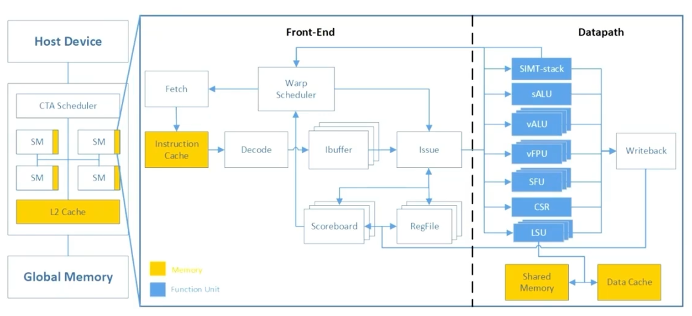

# 分支发散

## 乘影微架构中的sALU和vALU

乘影微架构与 AMD GPU 的设计类似，在其每个 SM（Streaming Multiprocessor）中包含一个 sALU（Scalar Arithmetic Logic Unit），用于执行标量操作。这些操作通常与工作组无关，比如常量加载或控制流相关的指令。这类指令不需要针对每个线程独立计算，而是可以在整个 warp 中共享计算结果。因此，程序中无发散的代码片段（即多个线程之间共享任务的部分）会在 sALU 中执行。

除此之外，SM 中还包含多个 vALU（Vector Arithmetic Logic Unit），用于执行矢量操作，是 GPU 处理 SIMT（Single Instruction Multiple Thread）风格计算的核心组件。vALU 会对 warp 中的每个线程执行相同的指令，但使用各自的线程数据。例如，当程序中存在有发散的代码片段（即线程级别的任务）时，每个线程会对不同的寄存器或内存位置进行操作，此类任务会在 vALU 上执行。

下图展示了乘影微架构，其中呈现了 sALU 和 vALU 在数据路径（Datapath）部分的位置和与其它模块的联系。



## 编译器的分支发散处理
在将 kernel 程序编译为汇编代码的过程中，编译器需要识别代码片段是否为发散代码。对于无发散代码，编译器会生成 RISC-V 的标量指令，以便这些代码在 sALU 中执行；而对于有发散代码，编译器会生成 RISC-V 的向量扩展指令，以便这些代码在 vALU 中执行。

此外，对于某些有发散代码片段（例如控制流中的 if 语句），编译器还需要生成 `vbeq` 和 `join` 指令，用于操控 SIMT 栈（SIMT stack），使程序能够分别执行控制流中的 True 和 False 分支。

### 识别代码是否发散

有发散代码包括：
-   `if`、`for`、`while` 等控制流语句；
-   `get global id`、`get local id` 等每个线程值不同的异构编程 API 调用；
-   函数调用（函数内部行为无法预测）；
-   原子操作（如 read-modify-write）；
-   私有内存访问（通常对应 GPU 中的向量指令 `vlw.v`）。

无发散代码包括：
-   `get work dim`、`get num groups` 等与当前线程无关的异构编程 API 调用；
-   常量相关的操作。

编译器通过 `SelectionDAG` 在 LLVM 后端实现分支发散场景的识别。具体地，在编译优化阶段添加 `LegacyDivergenceAnalysis` pass 来分析程序，并根据分析结果和代码类型区分发散和无发散代码片段。pass的具体实现位于 `llvm/lib/Target/RISCV/RISCVISelDAGToDAG.cpp`。

### 对有发散代码插入`vbeq`和`join`

`vbeq` 和 `join` 指令通过操控 SIMT 栈解决 warp 内部分支发散的问题。在分支执行过程中，SIMT 栈会根据掩码对需要执行和不需要执行的线程进行区分：
-   在执行 True 分支时，掩码会屏蔽 False 分支对应的线程；
-   在执行 False 分支时，掩码则屏蔽 True 分支对应的线程。
当硬件识别到 `vbeq` 指令时，会执行两次进栈操作，并进行第一次弹栈以处理 True 分支；当硬件识别到 `join` 指令时，会执行第二次弹栈以处理 False 分支。

编译器在LLVM的所有已有Pass执行完毕后，在代码生成步骤之前执行 `createVentusInsertJoinToVBranchPass` 插入 `vbeq` 和 `join` 指令。相关实现位于 `llvm/lib/Target/RISCV/VentusInsertJoinToVBranch.cpp`。

### 分支发散处理示例

以下是一个示例代码（来源于ventus-llvm的llvm/test/CodeGen/RISCV/VentusGPGPU/branch.ll），以及编译器生成的汇编代码解释：
```
; 源代码
define i32 @foo(i32 noundef %cond, i32 noundef %a, i32 noundef %b, i32 noundef %c) {
entry:
  %tobool.not = icmp eq i32 %cond, 0
  %mul = mul nsw i32 %b, %a
  %0 = sub i32 0, %c
  %retval.0.p = select i1 %tobool.not, i32 %0, i32 %c
  %retval.0 = add i32 %retval.0.p, %mul
  ret i32 %retval.0
}
```

```
; 汇编代码
foo:
  vmv.v.x v5, zero             ; 初始化向量寄存器 v5
  regexti zero, zero, 0        ; 设置标量寄存器为零
  vrsub.vi v4, v3, 0           ; 向量减法操作
.Lpcrel_hi0:
  auipc t1, %pcrel_hi(.LBB0_2) ; 计算分支地址
  setrpc zero, t1, %pcrel_lo(.Lpcrel_hi0)
  vbeq v0, v5, .LBB0_2         ; 判断分支条件，处理 True 分支
  
  # True 分支代码
  vadd.vx v4, v3, zero         ; 向量加法操作
.LBB0_2:
  join zero, zero, 0           ; 执行 False 分支后恢复上下文
  vmadd.vv v2, v1, v4          ; 向量乘加操作
  vadd.vx v0, v2, zero         ; 向量加法操作
  ret                          ; 返回结果
```

可以看到，`vbeq v0, v5, .LBB0_2` 指令根据条件选择 True 分支或跳转到 False 分支，其中 True 分支的代码在分支跳转后开始执行。`join` 指令则弹栈，恢复上下文以执行 False 分支。此外还可以注意到，分支内使用了向量操作（如 `vadd.vx` 和 `vmadd.vv`），表明代码发散。通过以上机制，编译器可以确保 warp 中的所有线程都能正确执行。
